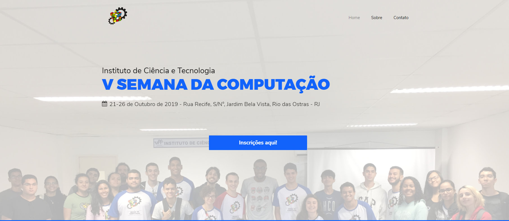

# SCOMPICT
Website para a Semana de Computação - 2019

Trata-se de um projeto web para reunir certas informações sobre o evento anual denominado "Semana da Computação" que é realizado durante a semana de Agenda Acadêmica no Campus Universitário de Rio das Ostras, no Instituto de Ciência e Tecnologia e ministrado por alunos e professores do curso de Ciência da Computação do própio campus. O intuito deste website foi apresentar algumas melhorias a antiga forma de apresentação e divulgação do evento, com a utilização de imagens, programações de eventos e links para inscrições aos eventos contidos na Semana de Computação. O evento conta com a staff principal que são os integrantes do Centro Acadêmico e mais alguns outros alunos que desejam participar da organização voluntariamente.
 

  

 
Este projeto terá uma reformulação em breve com novas funcionalidades ao próprio site.
 
Projeto realizado pelo CAC² - Centro Acadêmico Mônica de Sousa - Ciência da Computação - Rio das Ostras - Universidade Federal Fluminense
